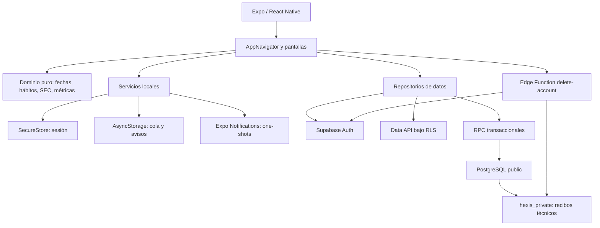

# Informe completo de la aplicación HEXIS

**Fecha de corte:** 12 de julio de 2026

**Última actualización de ejecución:** 13 de julio de 2026

**Repositorio:** `Proyectohexis/hexis-app`

**Commit del corte original verificado:** `79916fe300c166e476a8ded9704ce219779482f6`

**Plataformas objetivo:** teléfonos Android e iOS

**Coordinación:** `web-agency-operating-system`

**Clasificación:** informe interno; el repositorio fuente está actualmente publicado

## 1. Resumen ejecutivo

HEXIS es una aplicación móvil de progreso personal que traduce una identidad elegida en un protocolo pequeño de compromisos, registra evidencia diaria y cierra cada semana con una reflexión y una decisión. El producto evita la gamificación infantil, el castigo por perder una racha y las promesas clínicas; su propuesta es una experiencia sobria, privada y medible.

El estado real del proyecto es el de una **pre-alpha técnica con un vertical slice funcional y endurecido en entorno local**. El ciclo principal ya existe:

`identidad → protocolo → práctica diaria → evidencia → revisión semanal → ajuste`

La fase técnica interna fue aprobada inicialmente con **0 P0 y 0 P1 registrados en código y contratos locales**. Una auditoría posterior de Producto/UX detectó un P1 verificable en la primera revisión semanal: la UI permitía intentar cerrar una semana anterior al inicio del plan y el servidor la rechazaba correctamente. Ese resultado inicial queda como evidencia histórica. El 13 de julio se corrigió la elegibilidad en dominio y UI y se añadieron regresiones de semana parcial, frontera de lunes y zona del plan. El gate C0 sigue pendiente hasta publicar el corte y confirmar CI remota; el Gate Q1 continúa bloqueado por backend remoto, backup/restauración, builds firmados, matriz física Android/iOS, accesibilidad nativa, observabilidad, política legal, soporte y dogfood.

### Veredicto por nivel

| Nivel | Veredicto | Motivo |
|---|---|---|
| Código y contratos locales | Corrección integrada; C0 pendiente | UX-01 y SYNC-01 pasan regresión local; falta confirmar el nuevo CI remoto y QA nativo |
| Base técnica local de pre-alpha | Aprobada | Arranque Android limitado y flujos implementados; faltan pruebas físicas completas |
| Alpha interna distribuible | Bloqueada | No existe APK/IPA firmado e instalado |
| Beta externa | Bloqueada | Faltan research, legal, soporte, observabilidad y operación remota |
| Producción/datos reales | No-Go | Faltan infraestructura remota validada, release y gates operativos |

### Lo que sí puede afirmarse

- Existe una aplicación Expo/React Native que genera bundles Android e iOS.
- El loop diario está implementado en cliente, dominio y backend local; el loop semanal sigue parcial.
- El modelo de datos, RLS, RPC, privacidad y pruebas están versionados.
- La primera Revisión evita semanas fuera de vigencia y comunica cuándo estará disponible.
- Una cola offline ilegible genera un aviso durable mínimo antes de restablecerse y nunca se descarta si ese aviso no puede persistirse.
- El aislamiento usuario A/B/anónimo tiene evidencia automatizada local.
- El arranque y render inicial fueron observados en un Android físico mediante Expo Go.
- El commit de corte está publicado en GitHub.
- La ejecución remota GitHub Actions CI #1 terminó correctamente para ese commit.

### Lo que no puede afirmarse todavía

- Que HEXIS sea “la mejor aplicación de progreso personal”.
- Que exista product-market fit, retención o disposición a pagar.
- Que la experiencia sea completamente accesible en VoiceOver/TalkBack.
- Que los recordatorios funcionen correctamente en toda la matriz de fabricantes y estados de energía.
- Que el backend remoto esté seguro, recuperable o listo para datos reales.
- Que exista un build firmado aprobado por Apple o Google.
- Que la aplicación sea terapéutica, clínica o capaz de garantizar resultados.

## 2. Alcance, método y calidad de evidencia

Este informe consolida inspección directa de código, configuración, migraciones, pruebas, documentación, assets, Git y evidencia de ejecución. No sustituye investigación con usuarios, revisión legal ni QA nativo.

### Clasificación usada

| Clasificación | Significado |
|---|---|
| Verificado | Respaldado por código, prueba, log, archivo o inspección directa |
| Documentado | Existe una decisión escrita, pero aún no fue demostrada en operación |
| Inferencia | Conclusión técnica razonable derivada de evidencia |
| Hipótesis | Debe validarse con usuarios, mercado o producción |
| No verificado | No existe evidencia suficiente |

### Evidencia principal

- `README.md` y estado de ejecución.
- PRD, benchmark y arquitectura.
- 91 archivos analizados por el verificador sintáctico.
- 142 pruebas unitarias y de contrato.
- 68 aserciones pgTAP en PostgreSQL/Supabase local.
- E2E adverso de privacidad.
- Expo Doctor y exports Android/iOS.
- Smoke limitado en Android físico.
- Auditoría de dependencias y secretos.
- Commit Git/GitHub `79916fe`.
- Ejecución remota GitHub Actions CI #1 con estado `Success`.

## 3. Visión de producto

### 3.1 Problema que aborda

Muchas personas deciden cambiar, pero separan intención, acciones diarias y resultados en herramientas distintas. HEXIS busca resolver esa fragmentación mediante un sistema único que:

1. define quién quiere ser la persona;
2. convierte esa identidad en uno a tres compromisos observables;
3. permite una versión mínima para proteger continuidad;
4. registra evidencia sin ocultar fallos;
5. revisa la semana completa;
6. termina con una decisión explícita de ajuste.

### 3.2 Trabajo del usuario

> Cuando decido cambiar una parte de mi vida, quiero traducir esa intención en pocas acciones concretas, registrarlas sin fricción y revisar su efecto para saber si me estoy convirtiendo en la persona que decidí ser.

### 3.3 Público objetivo documentado

- Adultos de 18 años o más.
- Personas autodirigidas con una meta seria de cambio.
- Usuarios que han probado listas, trackers o apps de fitness sin sostener continuidad.
- Personas que prefieren privacidad, sobriedad y medición frente a monedas, mascotas o rankings.
- Beachhead hipotético: adulto hispanohablante enfocado en entrenamiento y hábitos fundacionales, con una métrica física opcional.

Esta definición es una hipótesis de producto; no existe aún investigación suficiente para declarar que sea el segmento correcto.

### 3.4 Exclusiones deliberadas

HEXIS no está planteada como terapia, diagnóstico, tratamiento, prescripción, programa de adicciones, intervención de trastornos alimentarios ni aplicación para menores. Tampoco incluye pagos, publicidad, comunidad pública, chat, IA clínica o integración obligatoria con hardware.

### 3.5 Propuesta de valor

La propuesta defendible por código es:

- identidad antes del tracker;
- protocolo limitado de uno a tres compromisos;
- acción mínima definida por el usuario;
- evidencia diaria en lugar de puntos virtuales;
- ajustes versionados que no reescriben el pasado;
- recuperación después del fallo;
- revisión semanal que conduce a una decisión;
- métrica de transformación opcional;
- exportación y borrado visibles dentro de la app.

La percepción “premium”, la superioridad competitiva y la disposición a pagar no están demostradas.

## 4. Mapa funcional de la aplicación

### 4.1 Navegación pública y autenticación

- Bienvenida.
- Selección de dirección de identidad.
- Alta con email y contraseña; la pantalla actual no solicita nombre.
- Estado de confirmación de email.
- Login.
- Solicitud y restablecimiento de contraseña mediante PKCE.
- Restauración segura de sesión.

### 4.2 Onboarding del plan

- Identidad objetivo.
- Resultado concreto.
- Motivo personal.
- Zona histórica del ciclo.
- Uno a tres compromisos.
- Acción observable y versión mínima.
- Días programados y hora opcional.
- Revisión previa antes de crear el plan.

### 4.3 Aplicación autenticada

La navegación principal contiene cinco tabs:

| Tab | Función |
|---|---|
| Hoy | Práctica aplicable a la fecha civil, check-in y sincronización |
| Hábitos | Protocolo, versiones, estados, descansos y recordatorios |
| Revisión | Semana cerrada, consistencia, recuperación y decisión |
| Métrica | Indicador opcional y su historial |
| Cuenta | Resumen, exportación, eliminación y logout |

### 4.4 Journey diario

1. La app calcula la fecha civil en la zona del plan.
2. Obtiene únicamente versiones y compromisos vigentes para ese día.
3. Aplica weekdays y descansos activos.
4. El usuario registra cumplimiento completo o versión mínima.
5. La evidencia se confirma en servidor o queda pendiente offline.
6. Los fallos terminales son visibles y reintentables.
7. El usuario puede retractar una evidencia sin borrar historia.

### 4.5 Gestión del protocolo

- Crear compromisos hasta ocupar tres slots.
- Editar mediante una nueva versión efectiva D+1.
- Pausar o archivar con cierre temporal.
- Reactivar creando una nueva versión.
- Programar o quitar descanso para el día siguiente.
- Reservar slots actuales y futuros sin solapamiento.
- Mostrar cambios pendientes y bloquear dobles mutaciones incompatibles.

### 4.6 Revisión semanal

- Trabaja con la semana completa anterior.
- Muestra realizado/programado y consistencia.
- Presenta trayectoria de 7 y 30 días.
- Desglosa por compromiso.
- Expone recuperación después de una interrupción.
- Guarda reflexión y decisión: mantener, reducir, aumentar o sustituir.
- Bloquea el cierre si existe evidencia offline sin conciliar.
- Navega a Disciplina para materializar manualmente el ajuste, pero no identifica el compromiso ni prepara un borrador.
- No integra todavía la métrica de transformación en la lectura semanal.
- No muestra un estado de elegibilidad para usuarios cuyo plan aún no solapa una semana cerrada.

### 4.7 Transformación medible

- Una métrica activa por plan.
- Tipos: peso, perímetro o personalizada.
- Valor, fecha civil y nota limitada.
- Último valor y diferencia descriptiva frente al anterior.
- Edición y eliminación lógica de entradas.
- Historial cargado hasta un máximo de 100 entradas.

### 4.8 Cuenta y derechos de datos

- Resumen de identidad, meta y zona.
- Exportación JSON mediante diálogo nativo.
- Eliminación con contraseña y frase exacta.
- Reconciliación segura si se pierde la respuesta HTTP.
- Limpieza local de sesión, cola y recordatorios.
- Logout con advertencia si existen operaciones offline.

## 5. Trazabilidad contra el PRD

| Requisito | Estado | Evidencia o brecha principal |
|---|---|---|
| HEX-P01 Autenticación y sesión | Implementado localmente | Registro, login, confirmación, PKCE, SecureStore y logout; QA remoto/físico pendiente |
| HEX-P02 Compromiso inicial | Implementado con brecha | Identidad/meta/motivo y 1–3 compromisos; Revisión no vuelve a mostrar identidad/meta |
| HEX-P03 Modelo de hábitos | Implementado | Acción mínima, weekdays, versión temporal, estados y slots |
| HEX-P04 Check-in diario | Implementado | Completo/mínimo, retractación, estados de sync y offline |
| HEX-P05 Fecha, consistencia y recuperación | Implementado en dominio | Fecha civil, 7/30, recuperación; racha calculada pero no expuesta visualmente |
| HEX-P06 Transformación medible | Implementado con brecha | Métrica y CRUD; no se sustituye/desactiva la métrica desde UI |
| HEX-P07 Revisión semanal | Parcial | El servidor valida semana cerrada, pero falta estado de elegibilidad, métrica contextual y ajuste preconfigurado |
| HEX-P08 Recordatorios | Implementado localmente | One-shots, quiet hours, límites, zona y descansos; matriz nativa pendiente |
| HEX-P09 Privacidad y cuenta | Implementado localmente | Export/delete y minimización; política, retención y soporte pendientes |
| HEX-P10 Marca y accesibilidad | Parcial | Contraste y semántica automatizados; assets finales y QA nativo pendientes |
| HEX-P11 Backend, confiabilidad y release | Parcial | RLS/RPC/CI local; remoto, backup, observabilidad y builds firmados pendientes |

## 6. Experiencia, interfaz y accesibilidad

### 6.1 Sistema visual actual

- Tema dark-first.
- Paleta Obsidiana, Carbón, Oro y Hueso.
- Tipografía Inter incluida localmente.
- Tokens de color, espaciado y tipografía centralizados.
- Cards, bordes, estados y acciones consistentes por código.
- Safe areas, scroll y tratamiento de teclado.

### 6.2 Accesibilidad verificada por código

- Contraste automatizado de 4.5:1 para texto y 3:1 para controles seleccionados.
- Roles para headings, botones, radios, checkboxes, switches y progressbar.
- Estados accesibles `checked`, `disabled`, `busy` y valores de progreso.
- Alertas y live regions para errores y sincronización.
- Gestión de foco en cambios de fase y modales.
- Targets principales de 44–54 puntos.
- Labels accesibles conservados cuando el tab visual se compacta.

### 6.3 Brechas de UX y accesibilidad

- No existe prueba física con VoiceOver o TalkBack.
- No se verificó texto al 200%, reduce motion, teclado, orientación ni teléfono pequeño.
- Fecha y hora se introducen manualmente como `YYYY-MM-DD` y `HH:MM`.
- La pantalla Disciplina concentra política global, ajustes por hábito y muchas acciones.
- Cinco tabs pueden aumentar carga de navegación en pantallas pequeñas.
- El copy está hardcoded en español; no existe catálogo i18n.
- La racha y el calendario visual prometidos no aparecen en la UI.
- No existe política de privacidad o soporte navegable sin sesión.
- Permanecen avisos de entorno de desarrollo que deben condicionarse por ambiente.
- No hay evidencia de que onboarding dure cuatro minutos o check-in menos de 60 segundos.

### 6.4 Identidad gráfica

El icono actual fue inspeccionado y corresponde a una cuadrícula/círculos de placeholder, no a una identidad final de HEXIS. El launcher, splash, adaptive icon y favicon deben sustituirse antes de cualquier build distribuible. Esta brecha es visible también en el smoke Android.

## 7. Arquitectura técnica

### 7.1 Diagrama de alto nivel



### 7.2 Stack verificado

| Capa | Tecnología |
|---|---|
| Runtime móvil | Expo SDK 54 |
| UI | React Native 0.81.5 + React 19.1 |
| Navegación | React Navigation 7 |
| Backend | Supabase Auth + Data API + PostgreSQL |
| Seguridad de datos | RLS forzado, grants mínimos, RPC `SECURITY DEFINER` |
| Edge | Supabase Edge Function / Deno |
| Sesión | Expo SecureStore |
| Cola y preferencias | AsyncStorage minimizado |
| Conectividad | NetInfo |
| Avisos | Expo Notifications |
| Exportación | Expo FileSystem + Sharing |
| Pruebas | `node:test`, pgTAP, Supabase local |
| Distribución planificada | EAS Build |

### 7.3 Separación de responsabilidades

- Las pantallas consumen repositorios en lugar de consultas dispersas.
- Las lecturas simples usan Data API con RLS.
- Las operaciones multi-fila o sensibles usan RPC.
- Las reglas deterministas viven en módulos `.cjs` testeables sin React Native.
- PostgreSQL es la fuente de verdad.
- La cola offline solo cubre evidencia diaria, no cualquier mutación arbitraria.
- Los avisos se derivan del estado vigente, no constituyen una fuente de verdad.

## 8. Modelo de datos y reglas de dominio

### 8.1 Entidades objetivo

| Entidad | Responsabilidad |
|---|---|
| `profiles` | Nombre, foco, locale, unidades y zona |
| `plans` | Identidad, meta, motivo, estado y vigencia |
| `habits` | Compromisos versionados y programados |
| `habit_completion_events` | Ledger append-only de registro/retractación |
| `habit_schedule_exceptions` | Descansos y exclusiones con tombstone |
| `transformation_metrics` | Métrica activa por plan |
| `metric_entries` | Valores históricos y notas |
| `weekly_reviews` | Reflexión y decisión semanal |
| `habit_daily_evidence` | Vista de evidencia vigente |
| `hexis_private.*` | Recibos de idempotencia sin contenido personal |

El modelo legacy `habits/progress/streaks` se conserva de forma aditiva durante la transición. No hay cutover destructivo automático.

### 8.2 Invariantes relevantes

- Un plan activo contiene entre uno y tres compromisos ejecutables.
- Los slots están limitados a `0..2`.
- Las reservas presentes y futuras no pueden solaparse por intervalo.
- Editar crea una nueva versión y preserva evidencia histórica.
- D/D+1 se decide con `starts_on` y `ends_on`, no con el estado raw adelantado.
- La evidencia es append-only; deshacer agrega una retractación.
- Los weekdays usan domingo `0` a sábado `6`.
- Una fecha civil pertenece a la zona del plan.
- Los descansos activos excluyen oportunidades y recordatorios.
- Una semana se cierra una sola vez por plan/fecha.
- Solo puede existir una métrica activa por plan.

### 8.3 RPC y concurrencia

El cliente consume 14 RPC versionadas para plan, hábitos, evidencia, descansos, métricas, entradas, revisión y exportación. Las operaciones incluyen:

- `client_operation_id` por usuario;
- fingerprints de payload;
- respuestas idempotentes;
- locks transaccionales/advisory;
- validación explícita de ownership;
- contratos temporales y de rango;
- rechazo de reutilización del mismo ID con contenido distinto.

MD5 se usa para comparar fingerprints, no como control criptográfico.

## 9. Offline y sincronización

La cola de check-ins implementa:

- allowlist estricta;
- máximo de 200 operaciones y 512 KB;
- estados `pending`, `in_flight` y `failed`;
- lease de 30 segundos;
- backoff de 5 segundos a 15 minutos;
- ocho intentos antes de fallo terminal;
- deduplicación por `operation_id`;
- aislamiento por usuario;
- reintento manual con la misma identidad y timestamp;
- recuperación fail-closed ante JSON corrupto;
- limpieza selectiva en logout y eliminación.

La sincronización se intenta al cargar Hoy, recuperar foco o conectividad. El almacenamiento está minimizado, pero AsyncStorage no aporta cifrado integral; IDs, fechas y horarios locales permanecen como riesgo P2 aceptado solo para desarrollo/alpha.

## 10. Recordatorios

### 10.1 Contrato implementado

- Avisos locales, no push.
- Permiso solicitado solo desde una acción explícita.
- Contenido genérico sin nombre de hábito ni texto privado.
- Triggers `DATE` one-shot; no recurrencias semanales sin fin.
- Horizonte rodante máximo de 21 días.
- Máximo de dos avisos por fecha/weekday y 42 pendientes en el horizonte.
- Quiet hours predeterminadas 22:00–07:00 y editables.
- Controles global e individual.
- Confirmación requerida tras cambio de zona.
- Pausa, archivo, descanso, logout y eliminación reconcilian/cancelan.
- Un fallo al persistir cancela avisos recién creados.

### 10.2 Limitaciones

- La configuración futura se renueva al abrir o reanudar HEXIS.
- Tras 21 días sin abrir la app, el horizonte se agota de forma segura.
- Si la zona cambia con la app completamente terminada, los avisos ya registrados se cancelan en el siguiente inicio.
- No existe evidencia física suficiente sobre Doze, Focus, reboot o fabricantes Android.

## 11. Seguridad, autenticación y privacidad

### 11.1 Sesión y autenticación

- Supabase Auth con flujo PKCE.
- Callback exacto `hexis://auth/reset-password`.
- Rechazo de tokens de flujo implícito.
- Sesión en SecureStore/Keychain/Keystore.
- Escritura fragmentada por bytes UTF-8 y doble slot recuperable.
- Migración y borrado de tokens legacy desde AsyncStorage.
- Marcador de instalación para evitar restauración indebida tras reinstalar.
- Android `allowBackup: false`.
- Logout limpia cola y recordatorios antes de revocar sesión.

### 11.2 Configuración segura

El cliente rechaza:

- Supabase remoto sin HTTPS;
- hosts remotos no autorizados;
- credenciales embebidas en URL;
- `sb_secret_`;
- JWT legacy en el bundle;
- claves distintas a `sb_publishable_`.

HTTP/JWT `anon` solo se acepta en loopback, emulador o red privada con opt-in explícito.

### 11.3 RLS y privilegios

- RLS habilitado y forzado.
- Policies ligadas a `auth.uid()`.
- `anon` sin acceso a datos autenticados.
- Grants mínimos y revocación inicial.
- Relaciones críticas con `(id, user_id)`.
- RPC sensibles con `SECURITY DEFINER`, `search_path=''` y ownership explícito.
- Evidencia protegida contra update/delete directo.
- Tombstones ocultos en lecturas ordinarias.

### 11.4 Exportación

- Ligada al caller autenticado.
- JSON versionado.
- Objetos construidos con allowlists explícitas.
- Incluye historial lógico necesario para una copia completa.
- Excluye credenciales, sesiones, fingerprints y recibos internos.
- Archivo temporal compartido mediante menú nativo.

### 11.5 Eliminación de cuenta

- Edge Function con JWT verificado.
- Solo `POST application/json`.
- Body real medido en streaming y limitado a 4096 bytes.
- Contraseña reautenticada server-side.
- Frase exacta `ELIMINAR HEXIS`.
- Service role solo dentro de la función.
- Eliminación limitada al caller.
- Recibo server-only de 24 horas para respuesta perdida.
- `Cache-Control: no-store`.
- Limpieza local con advertencia si quedan residuos.

### 11.6 Riesgos de privacidad pendientes

- Política de privacidad no aprobada.
- Retención y propietario de datos no aprobados.
- No existe contacto de privacidad/soporte publicado.
- Falta job programado de purga de recibos vencidos.
- No se validó export/delete en ambos sistemas físicos.
- No hay revisión legal por mercados o jurisdicciones.
- No se debe interpretar una métrica física como consejo médico.

## 12. Analítica y observabilidad

Existe una frontera local de nueve eventos de producto:

- schemas exactos;
- rechazo de PII y patrones sensibles;
- sin texto libre, arrays u objetos anidados;
- sin IDs automáticos;
- sink nulo por defecto;
- ningún proveedor configurado desde pantallas;
- fallos del sink no escapan ni registran payload.

Esto es positivo para privacidad, pero significa que actualmente no se recopilan activación, retención, SEC Rate, crashes ni rendimiento en usuarios reales. Las métricas del PRD son objetivos de aprendizaje, no resultados.

## 13. Calidad y evidencia reproducible

### 13.1 Resultado del corte

La tabla siguiente conserva la evidencia del corte original del 12 de julio. No debe confundirse
con una reejecución de todos los gates el día 13.

| Gate | Resultado |
|---|---:|
| Instalación limpia `npm ci` | PASS |
| Sintaxis | 91 archivos PASS |
| Imports externos declarados | PASS |
| Unit tests y contratos | 142/142 PASS |
| Expo Doctor | 18/18 PASS |
| Export Android | PASS, Hermes 3.50 MB |
| Export iOS | PASS, Hermes 3.49 MB |
| Supabase reset + pgTAP | 68/68 PASS |
| Privacidad adversa E2E | PASS |
| GitHub Actions CI #1 | SUCCESS, 2 min 31 s |
| Android físico / Expo Go | PASS limitado: arranque y render inicial |
| Secret scan | Sin patrones sensibles confirmados |
| `npm audit --omit=dev` | 0 críticas, 0 altas, 14 moderadas, 1 baja |
| Árbol completo de dependencias | 0 críticas, 0 altas, 16 moderadas, 1 baja |
| Gate técnico interno Fase 9 | APROBADO en su corte; reabierto por P1 posterior de primera revisión |

### 13.1.1 Actualización local del 13 de julio

| Gate | Resultado |
|---|---:|
| Sintaxis | 95 archivos PASS |
| Imports externos declarados | PASS |
| Unit tests y contratos | 158/158 PASS |
| Elegibilidad de primera Revisión | PASS en plan nuevo, semana parcial, domingo/lunes y dos zonas |
| Recuperación de cola ilegible | PASS: aviso mínimo durable, confirmación y fallo conservador |
| Secret scan actual | PASS local para archivos versionados de texto; no cubre historial, entropía ni binarios |
| Workflow reforzado | Implementado; ejecución remota pendiente al redactar esta actualización |

Los conteos de `npm audit` anteriores representan nodos afectados del árbol. La consulta de advisories únicos encontró cuatro avisos activos: tres moderados (`js-yaml`, `postcss`, `uuid`) y uno bajo (`@babel/core`), principalmente transitivos del toolchain Expo/Metro.

### 13.2 Alcance real del smoke Android

El dispositivo confirmó que Expo Go recibió el bundle y abrió HEXIS. No demostró:

- APK firmado;
- cold start de release;
- autenticación completa;
- check-in y offline;
- recordatorios;
- export/delete;
- accesibilidad;
- reinstalación;
- rendimiento;
- compatibilidad de matriz Android.

No existe evidencia física de iOS.

### 13.3 CI y repositorio

- Workflow GitHub Actions versionado para checks móviles y base de datos.
- La [ejecución CI #1](https://github.com/Proyectohexis/hexis-app/actions/runs/29217606569) del commit `79916fe` terminó en `Success`: `mobile-checks` en 1 min 16 s y `database-checks` en 2 min 27 s.
- La CI ejecutó instalación exacta, sintaxis, dependencias declaradas, 142 pruebas, Expo Doctor, exports Android/iOS, auditoría crítica, Supabase desde cero y pgTAP.
- GitHub mostró dos advertencias en el corte original porque Actions v4 aún declaraban Node 20 y el runner las forzaba a Node 24.
- `eas.json` exige un commit limpio antes de construir.
- Commit de corte publicado en GitHub: `79916fe`.
- Worktree limpio al cerrar la fase técnica.
- El repositorio es público. La protección de `main` no pudo verificarse sin permisos administrativos.
- El workflow preparado el 13 de julio añade bloqueo high/critical, `test:privacy:e2e`, un escáner de secretos de alta confianza sobre la revisión actual y artefactos compactos con 14 días de retención. Debe pasar en GitHub Actions antes de considerarse evidencia. El escáner aún no cubre historial Git, entropía ni binarios, y las Actions usan tags mayores en lugar de SHA inmutable.

## 14. Preparación de release

### 14.1 Configuración existente

- Perfil EAS `preview` para APK interno.
- Perfil `production` para AAB con auto-incremento.
- Versión de aplicación pre-alpha `0.1.0`.
- Scheme `hexis`.
- Orientación flexible.
- UI dark-first.
- Android backup deshabilitado.

### 14.2 Faltantes obligatorios

- `ios.bundleIdentifier` definitivo.
- `android.package` definitivo.
- Proyecto/organización EAS y `projectId`.
- Apple Developer Team y Google Play Console.
- Credenciales y variables por ambiente.
- App Links/Universal Links para recuperación.
- Assets finales de marca.
- APK preview instalado y probado.
- Build iOS interno instalado y probado.
- Política, soporte y publisher legal.
- Material y disclosures de tiendas.
- Copyright/licencia del proyecto corregidos y aprobados.
- CI endurecida para bloquear severidad alta, ejecutar privacidad adversa y escanear secretos.

## 15. Riesgos y deuda priorizada

### 15.1 Bloqueadores de producción

| ID | Riesgo | Acción requerida |
|---|---|---|
| R-01 | Supabase remoto no inventariado | Crear dev/staging, comparar schema, probar backup/restauración |
| R-02 | No hay builds firmados | Definir IDs/EAS, generar e instalar Android/iOS |
| R-03 | QA físico incompleto | Ejecutar matriz funcional, accesible, offline, privacidad y avisos |
| R-04 | Auth de producción no endurecido | SMTP, email confirmation, safe password change, CAPTCHA/rate limits y redirects |
| R-05 | Sin observabilidad | Proveedor aprobado, crashes, rendimiento, alertas y runbooks sin PII |
| R-06 | Legal/privacidad/soporte incompletos | Política, retención, contacto, responsable y revisión jurídica |
| R-07 | Identidad visual provisional | Sustituir iconos/splash y validar sistema final |
| R-08 | Valor no demostrado | Entrevistas, usabilidad y piloto con métricas reales |
| R-09 | Gobierno de código/licencia inconsistente | Decidir visibilidad/licencia y sustituir el copyright heredado de Expo |
| R-10 | CI no cubre todo el gate Q1 | Bloquear altas, ejecutar privacidad adversa, secret scan y conservar artefactos |
| R-11 | Loop semanal parcial | Corregir elegibilidad, integrar contexto/métrica y preparar un ajuste D+1 accionable |

### 15.2 Deuda técnica P2

- AsyncStorage no cifra integralmente cola/estado de avisos.
- La migración `006` parchea funciones por texto y debe consolidarse como SQL explícito.
- Falta prueba concurrente real desde dos dispositivos/sesiones.
- Los recibos de eliminación no tienen purga programada independiente.
- Cambio de zona con app terminada se detecta en el siguiente inicio.
- Custom scheme sin Universal Links/App Links.
- CORS de la función debe reevaluarse si se reutiliza desde web.
- Dependencias transitivas mantienen avisos moderados; no se debe forzar un salto mayor sin matriz Expo.
- Inputs de fecha/hora no están localizados.
- No existe paginación del historial de métrica.
- No hay i18n real ni reduce motion.
- Actions usan tags móviles en vez de SHA inmutable y el pipeline no produce builds EAS firmados.

### 15.3 Brechas de producto

- Racha calculada pero no visible.
- Sin calendario visual de evidencia.
- Identidad/meta ausentes en Revisión.
- Métrica activa no sustituible/desactivable desde UI.
- Decisión semanal no prepara automáticamente el cambio.
- La elegibilidad de la primera Revisión fue corregida localmente el 13 de julio; falta QA nativo del estado y del copy.
- No hay preferencias editables de perfil, zona o unidades.
- Política y soporte no son accesibles antes de login.
- Analítica deshabilitada impide medir objetivos.

## 16. Hechos, inferencias e hipótesis

| Afirmación | Clasificación |
|---|---|
| El loop diario identidad→protocolo→evidencia existe | Verificado |
| Revisión→ajuste→transformación forma un ciclo cerrado | No; implementación parcial |
| La evidencia diaria soporta full/minimum/offline | Verificado |
| El aislamiento local A/B/anon pasa pruebas | Verificado localmente |
| La estética es dark-first y sobria | Verificado por código |
| La experiencia se percibe premium | Hipótesis |
| El lenguaje de identidad será comprendido | Hipótesis |
| La revisión semanal mejorará retención | Hipótesis |
| La métrica física aportará valor | Hipótesis |
| HEXIS supera a referentes de mercado | No demostrado |
| El pricing documentado es viable | Hipótesis no aprobada |
| Se cumplen WCAG AA y accesibilidad nativa | No verificado |
| Existe product-market fit | No demostrado |
| El backend de producción es seguro/recuperable | No verificado |

## 17. Plan recomendado de continuación

No hay una fecha de release aprobada. La secuencia debe avanzar por gates, no por calendario impuesto.

### Etapa A — QA Android y acabado visible

1. Resolver visibilidad, licencia y copyright del repositorio.
2. Endurecer CI para severidad alta, privacidad adversa y secretos.
3. Sustituir icono, adaptive icon y splash provisionales.
4. Completar el smoke funcional en el Android actual.
5. Probar auth, onboarding, Hoy, offline, revisión y errores.
6. Probar recordatorios: permisos, descanso, pausa, reboot y zona.
7. Probar exportación y eliminación en menú nativo.
8. Ejecutar TalkBack y fuente máxima.

**Salida:** evidencia física Android reproducible y lista de defectos.

### Etapa B — Backend remoto y recuperación

1. Crear o recuperar Supabase dev.
2. Inventariar schema/policies/configuración.
3. Probar backup y restauración.
4. Aplicar migraciones primero en staging.
5. Endurecer Auth, SMTP, redirects y antiabuso.
6. Programar purga de recibos.

**Salida:** backend dev/staging recuperable, sin datos reales.

### Etapa C — Builds firmados

1. Aprobar IDs y publisher.
2. Configurar EAS y ambientes.
3. Generar APK preview.
4. Instalar y repetir QA Android sin Expo Go.
5. Generar build interno iOS.
6. Ejecutar smoke y accesibilidad en iPhone.

**Salida:** artefactos firmados por plataforma.

### Etapa D — Operación y cumplimiento

1. Aprobar política de privacidad, retención y soporte.
2. Seleccionar observabilidad redactada.
3. Crear runbooks de incidentes, rollback y eliminación.
4. Completar disclosures de tiendas.
5. Ejecutar security review y prueba concurrente real.

**Salida:** Q1 técnicamente evaluable.

### Etapa E — Evidencia de valor

1. Realizar 12–15 entrevistas.
2. Ejecutar 5–8 pruebas de usabilidad.
3. Ajustar onboarding, Hoy, fallo/reentrada y Revisión.
4. Hacer dogfood interno.
5. Solo después, piloto privado de 20–30 personas.
6. Medir activación, D1/D7, SEC y retorno tras fallo sin contenido privado.

**Salida:** evidencia para decidir beta, no una promesa de éxito.

## 18. Operación local y continuidad

### Requisitos

- Node.js 20.19 o superior.
- npm 11 recomendado.
- Docker Desktop.
- Supabase CLI fijada por el proyecto.
- Expo Go 54 para el smoke actual o development build equivalente.

### Comandos principales

```bash
npm ci
npm run check
npm run test:db
npm run test:privacy:e2e
npm start
```

`npm run test:db` reinicia la base local y elimina cuentas/datos de prueba. No debe ejecutarse contra un entorno remoto con datos.

### Variables del cliente

- `EXPO_PUBLIC_SUPABASE_URL`
- `EXPO_PUBLIC_SUPABASE_PUBLISHABLE_KEY`
- `EXPO_PUBLIC_ALLOW_LOCAL_SUPABASE`

Nunca deben usarse `service_role`, `sb_secret_`, contraseñas de base o secretos de proveedor en `EXPO_PUBLIC_*`.

## 19. Decisiones recomendadas a Dirección

1. Mantener el producto como alpha privada, no como beta pública.
2. Priorizar QA físico y backend remoto antes de nuevas features.
3. Aprobar o cambiar el segmento objetivo después de research.
4. No activar monetización hasta demostrar activación, SEC y seguridad.
5. No activar analítica hasta aprobar proveedor, consentimiento y política.
6. Aprobar identidad gráfica antes del primer build firmado.
7. Definir un responsable nominal de privacidad, release y soporte.
8. Consolidar la migración temporal antes de producción.
9. Corregir de inmediato el aviso de copyright MIT heredado del template Expo o escoger otra política de licencia con revisión competente.

## 20. Conclusión

HEXIS dejó de ser un prototipo improvisado: hoy tiene un loop diario coherente, dominio temporal explícito, backend reproducible, controles de aislamiento, offline, privacidad, CI remota verde y una base de pruebas seria. La arquitectura local es defendible y la calidad interna ha mejorado sustancialmente, pero el loop semanal todavía no cierra revisión, ajuste y transformación de forma accionable.

La verdad incómoda es que todavía no es un producto listo para el público. La falta de builds firmados, QA nativo completo, backend remoto recuperable, política legal, observabilidad y evidencia con usuarios impide aprobar producción o beta externa. Además, el repositorio ya es público y el archivo `LICENSE` conserva el copyright del template Expo, por lo que el gobierno de propiedad intelectual debe resolverse de inmediato. Seguir añadiendo funcionalidades antes de cerrar esos gates aumentaría el riesgo y reduciría la velocidad real.

**Gate del informe:** aprobado con observaciones para continuidad interna.

**Gate de release:** bloqueado.

**Siguiente departamento:** Device Lab/QA móvil → Cloud/DevOps → Release → UX Research.

## 21. Documentos y evidencia relacionados

- `README.md`
- `docs/product/PRODUCT_STRATEGY_AND_PRD.md`
- `docs/strategy/BENCHMARK_HEXIS_2026.md`
- `docs/architecture/TECHNICAL_ARCHITECTURE.md`
- `docs/roadmap/DEVELOPMENT_PLAN.md`
- `docs/roadmap/ANALISIS_DE_BRECHAS_Y_PLAN_MAESTRO_2026-07-12.md`
- `docs/execution/EXECUTION_STATUS_2026-07-12.md`
- `docs/release/ALPHA_RELEASE_READINESS_2026-07-12.md`
- `docs/release/ANDROID_DEVICE_SMOKE_2026-07-12.md`
- `docs/release/LOCAL_REMINDERS_2026-07-12.md`
- `docs/privacy/DATA_RIGHTS_IMPLEMENTATION_2026-07-12.md`
- `docs/analytics/EVENT_TAXONOMY_V1.md`
- `supabase/README.md`
- GitHub: `https://github.com/Proyectohexis/hexis-app`
- Commit: `https://github.com/Proyectohexis/hexis-app/commit/79916fe300c166e476a8ded9704ce219779482f6`
- CI #1: `https://github.com/Proyectohexis/hexis-app/actions/runs/29217606569`
