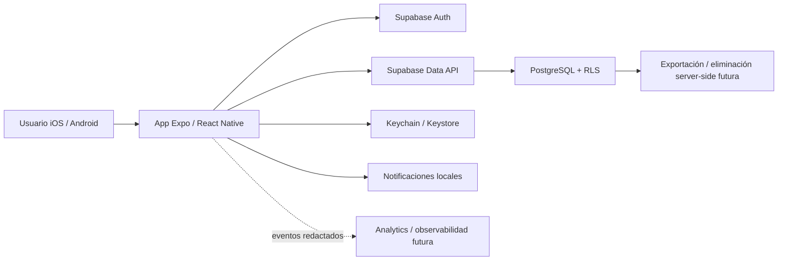
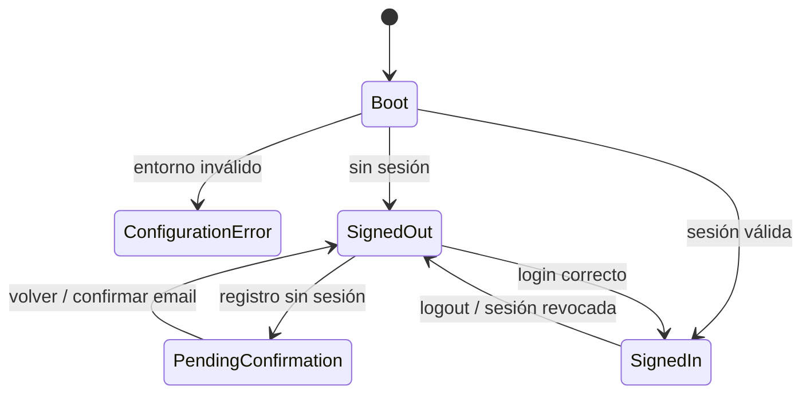

# Arquitectura técnica objetivo — HEXIS

**Versión:** 1.0
**Fecha:** 11 de julio de 2026
**Estado:** decisión de arquitectura para MVP; el esquema remoto actual debe inventariarse antes de aplicar migraciones.

## 1. Decisiones

| Área | Decisión MVP | Motivo |
|---|---|---|
| Cliente | Expo SDK 54 + React Native 0.81 + React 19 | Base existente; estabilizar antes de cualquier upgrade mayor |
| Plataformas | iOS y Android teléfono | Coincide con el segmento; web queda fuera del MVP |
| Navegación | React Navigation 7 + Native Stack + Bottom Tabs | Transiciones nativas, menor dependencia JS y mejor rendimiento |
| Backend objetivo | Supabase Auth + PostgreSQL + Data API | Cliente existente; esquema remoto y RLS aún no verificados |
| Persistencia | Servidor como source of truth + cola local posterior | El MVP debe expresar estado pendiente/error sin perder input |
| Sesión | Keychain/Keystore mediante Expo SecureStore | Los tokens no pertenecen a AsyncStorage sin cifrar |
| Estado remoto | Repositorios por dominio; caché explícita en fase siguiente | Evitar consultas dispersas en pantallas |
| Datos | Eventos de ejecución inmutables/idempotentes | Permite historial, consistencia y sincronización real |
| Métricas | Cálculo explicable desde datos fuente | Evitar scores opacos |
| Analítica | Eventos redactados, sin texto ni valores privados | Minimización por diseño |
| IA | Fuera del MVP | Faltan datos, consentimiento, evals y guardrails |

## 2. Contexto del sistema



No se incluye un servicio de IA, comunidad, fotos, compras o wearables en el límite del MVP inicial.

## 3. Capas del cliente

```text
src/
  components/        UI reutilizable y accesible
  navigation/        auth stack y app tabs
  screens/           composición por pantalla
  features/
    auth/
    commitment/
    habits/
    transformation/
    weekly-review/
    account/
  data/
    repositories/    única frontera con Supabase
    sync/             idempotencia, cola y reintentos
  lib/                cliente Supabase, storage, fecha, validación
  theme/              tokens de color, tipografía, espacio y motion
  analytics/          eventos allowlist y redacción
```

La migración será incremental. No se moverá código solo para “verse limpio”: cada extracción debe reducir duplicación, permitir tests o fijar una frontera de seguridad.

## 4. Navegación y estados de sesión



Reglas:

- `Main` no se declara en el stack público.
- La navegación reacciona al estado de sesión; una pantalla no fuerza entrada a Main.
- Registro devuelve un estado verificable: sesión creada o confirmación pendiente.
- Logout borra sesión remota/local y vuelve a `SignedOut`.
- Configuración faltante produce una pantalla de diagnóstico, no un crash/blank screen.

## 5. Modelo de datos objetivo

### Entidades

#### `profiles`

- `id uuid` PK/FK a `auth.users`.
- `display_name text`.
- `focus_domain text`.
- `timezone text` IANA.
- `locale text`.
- `unit_system text`.
- timestamps.

#### `plans`

- `id uuid`.
- `user_id uuid`.
- `identity_statement text`.
- `outcome_statement text`.
- `why_statement text`.
- `status active|completed|archived`.
- `starts_on`, `ends_on` opcional.
- timestamps.

`plans.identity_statement` es la fuente de verdad de la identidad elegida. Solo habrá un plan activo por usuario en Core, reforzado por un índice único parcial sobre `user_id where status = 'active'`.

#### `habits`

- `id uuid`.
- `user_id uuid`.
- `plan_id uuid`.
- `name text`.
- `minimum_action text`.
- `cue_type time|event|location|none`.
- `cue_value jsonb` validado.
- `scheduled_weekdays smallint[]` (0–6).
- `reminder_time time` opcional.
- `timezone text`.
- `status active|paused|archived`.
- `position smallint`.
- timestamps.

#### `habit_completion_events`

- `id uuid`.
- `user_id uuid` redundante para RLS y queries seguras.
- `habit_id uuid`.
- `local_date date`.
- `occurred_at timestamptz`.
- `timezone text` IANA usada al decidir `local_date`.
- `event_type recorded|retracted`.
- `completion_level minimum|full` nullable en una retractación.
- `source manual|offline_sync|integration`.
- `client_operation_id uuid` para idempotencia.
- `supersedes_event_id uuid` opcional para enlazar una retractación.
- timestamps.

Constraints esenciales:

- `unique (user_id, client_operation_id)`.
- trigger que verifica que `habit.user_id = event.user_id`.
- los eventos son append-only; una vista deriva el estado vigente por usuario/hábito/fecha.

#### `transformation_metrics`

- `id uuid`.
- `user_id uuid`.
- `plan_id uuid`.
- `kind weight|circumference|custom`.
- `label text`, `unit text`.
- `status active|archived`.
- timestamps.

#### `metric_entries`

- `id uuid`.
- `user_id uuid`.
- `metric_id uuid`.
- `value numeric` con límites por tipo.
- `local_date date`.
- `recorded_at timestamptz`.
- `note text` limitada.
- `client_operation_id uuid`.
- timestamps.

#### `weekly_reviews`

- `id uuid`.
- `user_id uuid`.
- `plan_id uuid`.
- `week_start date`.
- `reflection text` limitada.
- `decision keep|reduce|increase|replace`.
- `created_at`.
- `unique (user_id, plan_id, week_start)`.

### Datos derivados

Racha, consistencia 7/30, SEC y mejor continuidad se derivan de programación + vista vigente de eventos. No se mantiene una tabla `streaks` mutable como fuente de verdad.

## 6. Fecha civil y zona horaria

Cada ejecución guarda:

- instante absoluto (`occurred_at` UTC);
- fecha civil decidida (`local_date`);
- zona del hábito/perfil en el momento de la operación.

Reglas:

1. La UI nunca usa `toISOString().split('T')[0]` para decidir el día del usuario.
2. El cliente envía `local_date`, pero la función transaccional valida el hábito y el usuario.
3. Cambiar zona afecta futuras operaciones; no reescribe historial silenciosamente.
4. La racha cuenta solo fechas programadas.
5. Pausas/descansos planificados no se convierten en fallos.

## 7. API y atomicidad

Las lecturas simples pueden usar Data API con RLS. Las operaciones que afectan varias filas o una métrica derivada usan funciones PostgreSQL (`security invoker` cuando sea posible):

- `record_habit_completion(habit_id, local_date, occurred_at, timezone, client_operation_id)`.
- `retract_habit_completion(habit_id, local_date, occurred_at, timezone, client_operation_id)`; añade un evento, no borra historial.
- `complete_weekly_review(...)`.
- `request_account_export()` mediante backend seguro posterior.
- `request_account_deletion()` mediante Edge Function autenticada posterior.

Un doble toque o reintento con el mismo `client_operation_id` debe devolver el resultado existente.

## 8. RLS y seguridad

Antes de cerrar T1, todas las tablas de usuario deberán:

- tener RLS habilitado y forzado donde sea compatible;
- negar acceso por defecto;
- aplicar `auth.uid() = user_id` para select/insert/update/delete;
- validar relaciones padre-hijo, no solo el `user_id` enviado por cliente;
- pasar tests A/B/anónimo.

La publishable key puede vivir en `EXPO_PUBLIC_*`; una service-role key jamás entra al bundle. Cualquier integración con secreto se ejecuta server-side.

### Sesión local

- SecureStore cifra en Android Keystore/iOS Keychain.
- Como plataformas antiguas pueden rechazar payloads grandes, el adaptador divide la sesión en fragmentos pequeños y maneja errores.
- En la migración inicial puede leer una sesión antigua de AsyncStorage, moverla y eliminar el original.
- Los datos de dominio sensibles no se persisten indiscriminadamente en estado global.

Referencias: [seguridad de React Native](https://reactnative.dev/docs/security), [SecureStore SDK 54](https://docs.expo.dev/versions/v54.0.0/sdk/securestore/), [RLS de Supabase](https://supabase.com/docs/guides/database/postgres/row-level-security).

## 9. Privacidad

Inventario mínimo:

| Dato | Finalidad | Sensibilidad | Retención inicial |
|---|---|---|---|
| Email | Cuenta y recuperación | Personal | Vida de cuenta + obligación aprobada |
| Nombre visible | Personalización | Personal | Vida de cuenta |
| Identidad/meta | Core loop | Privado | Vida del plan/cuenta |
| Hábitos/ejecuciones | Core loop y tendencias | Privado | Vida de cuenta |
| Métrica/nota | Transformación opcional | Sensible | Vida de cuenta o borrado por entrada |
| Zona/locale | Fecha y formato | Técnica | Vida de cuenta |
| Eventos redactados | Producto/confiabilidad | Pseudónimo | Ventana limitada por política |

Antes de beta deben existir:

- aviso contextual antes de métrica sensible;
- política de privacidad y retención aprobadas;
- exportación completa;
- eliminación autenticada;
- contacto de privacidad/soporte;
- contratos y configuración de cualquier proveedor de observabilidad.

## 10. Offline y sincronización

Fase inicial:

- Las lecturas muestran estado cargando/vacío/error.
- Una mutación no comunica éxito definitivo hasta persistir.
- El input se conserva al fallar y existe reintento.

Fase MVP completa:

- Cola local con `client_operation_id`.
- Estados `pending`, `syncing`, `confirmed`, `failed`.
- Reintento exponencial con límite.
- Idempotencia server-side.
- Conflicto resuelto por reglas de dominio, no “last write wins” genérico.

## 11. Accesibilidad y diseño

- `SafeAreaProvider` en la raíz y layout compatible con edge-to-edge.
- Controles táctiles de al menos 44×44 pt equivalentes.
- Roles, labels, hints y estados seleccionados.
- Errores asociados a su campo y anunciables.
- Texto dinámico al 200% sin truncar funciones críticas.
- Contraste AA; Hueso sobre Oro no se utiliza como combinación de botón.
- No depender solo de color para completado/error.
- Reduce Motion en transiciones futuras.

Referencias: [React Native Accessibility](https://reactnative.dev/docs/accessibility), [WCAG 2.2 contraste](https://www.w3.org/WAI/WCAG22/Understanding/contrast-minimum.html).

## 12. Calidad y CI

Cada pull request debe ejecutar:

1. instalación exacta desde lockfile;
2. validación de sintaxis/lint;
3. unit tests de fecha, consistencia, validación y redacción;
4. Expo Doctor;
5. bundles JavaScript Android/iOS en un runner compatible;
6. migraciones en base efímera;
7. tests RLS usuario A/B/anónimo;
8. E2E de auth/check-in/revisión antes de beta.

Los builds nativos firmados son un gate separado y requieren credenciales, perfiles y runners de plataforma apropiados.

Gates de release:

- cero críticos/altos abiertos sin aceptación explícita;
- sesiones sin crash ≥99.5% beta;
- flujos P0 accesibles;
- inventario de datos y store disclosures consistentes;
- rollback y soporte documentados.

## 13. Entornos y entrega

Entornos separados:

- local;
- preview/development;
- staging;
- production.

Cada uno tiene proyecto Supabase, publishable key y redirects propios. EAS profiles y bundle IDs se fijan antes del primer build distribuido; cambiarlos después tiene alto costo.

## 14. Migración desde el prototipo

1. Cerrar build/dependencias y navegación.
2. Unificar auth y sesión segura.
3. Inventariar esquema remoto mediante Supabase CLI/dump.
4. Convertir ese estado en una migración baseline sin destruir datos.
5. Crear tablas objetivo y funciones atómicas.
6. Migrar `completed_date` a eventos iniciales en `habit_completion_events`.
7. Migrar `progress` a métricas/entradas.
8. Verificar conteos y checksums por usuario.
9. Cambiar repositorios del cliente.
10. Mantener rollback/read-only de tablas legacy durante una ventana definida.
11. Retirar `streaks`, `completed` y `completed_date` solo tras reconciliación.

**Gate actual:** no aplicar una migración destructiva sin el inventario remoto y un backup probado.
