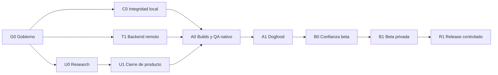

# Análisis de brechas y plan maestro de HEXIS

**Fecha de corte:** 12 de julio de 2026

**Última actualización de ejecución:** 13 de julio de 2026

**Estado base:** pre-alpha local endurecida

**Gate global:** bloqueado para alpha distribuible, beta externa y producción

**Coordinación:** `web-agency-operating-system`

**Roles:** App Product Manager, UX/UI Audit Specialist, Technical Audit Specialist, Release Roadmap Manager y Truth Auditor

## 1. Decisión ejecutiva

HEXIS tiene una base técnica inusualmente sólida para su etapa: dominio temporal explícito, historial por eventos, RLS forzado, mutaciones idempotentes, offline acotado, derechos de datos y CI verde. El problema principal ya no es “hacer que compile”.

El problema real es que la aplicación todavía no demuestra tres cosas:

1. que el ciclo semanal termine en un ajuste accionable;
2. que usuarios reales comprendan y valoren el modelo de identidad, evidencia y revisión;
3. que el sistema sea seguro, recuperable, observable y usable fuera del entorno local.

La ruta correcta no es añadir IA, comunidad, monetización ni más métricas. La ruta es:

`corregir verdad y gobierno → cerrar el núcleo → validar producto → desplegar staging → firmar builds → QA nativo → dogfood → beta privada → release controlado`

### 1.1 Avance ejecutado el 13 de julio

El primer corte R0/R1 ya produjo cambios verificables, sin adelantar gates externos:

- versión de pre-alpha alineada a `0.1.0` en Expo, paquete y lockfile;
- UX-01 implementado con semana ISO cerrada, zona del plan, primera fecha disponible,
  guard de envío y limpieza del borrador/operación al cambiar cuenta, plan o semana;
- SYNC-01 implementado con aviso durable mínimo, recuperación conservadora, confirmación
  protegida contra concurrencia y reconocimiento aislado por cuenta/generación;
- CI-01 endurecido para advisories high/critical, privacidad E2E, secret scan y artefactos;
- copy visible depurado y protegido con una regresión editorial AST de alcance parcial;
- typecheck incremental verde sobre 20 módulos del núcleo y Deno check/lint añadidos para la
  Edge Function; la deuda global permanece visible con 53 diagnósticos en 10 archivos;
- PRV-01 documentado sin cambiar la base antes de una decisión Legal/DPO;
- protocolo U0 listo para aprobación, con 0 participantes reclutados y 0 sesiones ejecutadas;
- registro G0 creado; propiedad, licencia, visibilidad, IDs, cuentas y owners siguen abiertos.

El estado operativo y la evidencia del corte están en
`docs/execution/SPRINT_0_EXECUTION_2026-07-13.md`. La revisión cruzada terminó sin P0/P1 en el
alcance corregido y [GitHub Actions #29293297372](https://github.com/Proyectohexis/hexis-app/actions/runs/29293297372)
confirmó `mobile-checks` y `database-checks`, incluidos los nuevos gates TypeScript/Deno; C0 está
aprobado para este alcance técnico local.

## 2. Correcciones al diagnóstico anterior

La auditoría detallada encontró afirmaciones que debían matizarse o corregirse:

- La pantalla de alta no solicita nombre; solicita email y contraseña.
- El loop diario está implementado, pero el loop semanal es parcial.
- HEX-P07 no puede figurar como completamente implementado.
- La primera revisión podía mostrarse antes de ser elegible. La corrección local del 13 de julio ahora calcula la última semana cerrada en la zona del plan y evita consultar/enviar una semana que no solapa su vigencia.
- La decisión semanal solo navega a Hábitos; no identifica el compromiso ni prepara el cambio.
- La revisión no integra la métrica de transformación.
- El historial de métrica está limitado a 100 entradas y no tiene paginación.
- La analítica está deshabilitada y el contrato actual, por sí solo, no permite calcular cohortes D1/D7/SEC.
- El borrado de una entrada métrica es lógico: oculta la fila al usuario, pero conserva valor/nota y la exportación los incluye. La política y el copy deben decir si eso es retención histórica o si debe purgarse.
- La recuperación de una cola local corrupta quedaba marcada internamente sin comunicar la pérdida potencial. El corte del 13 de julio añadió aviso durable, recuperación fail-closed y reconocimiento aislado por cuenta; queda QA nativo.

Estas correcciones no invalidan la arquitectura. Reabrieron el gate de “0 P0/P1”; UX-01 ya
tiene corrección y regresiones locales, pero C0 permanece abierto hasta confirmar el conjunto
integrado en CI remota y cerrar o aceptar explícitamente cualquier riesgo residual.

## 3. Lectura por áreas

La siguiente escala es una evaluación técnica, no una métrica científica:

| Área | Estado | Lectura honesta |
|---|---|---|
| Propuesta de producto | Fuerte | Diferenciada y coherente; todavía es una hipótesis sin research |
| Loop diario | Fuerte localmente | Hoy, check-in, mínimo, offline y retractación están bien resueltos |
| Loop semanal | Parcial mejorado | La elegibilidad está corregida localmente; métrica y ajuste accionable siguen abiertos |
| UX | Prometedora | Buena semántica por código; falta validación, simplificación y QA nativo |
| Marca | Incompleta | Sistema dark-first consistente, pero assets de Expo siguen provisionales |
| Arquitectura | Fuerte localmente | Capas claras, dominio testeable y servidor como fuente de verdad |
| Seguridad/privacidad | Fuerte localmente | Buenas fronteras; operación real, retención y antiabuso siguen pendientes |
| QA automatizado | Fuerte para pre-alpha | El corte vigente pasa 175/175 tests locales; CI cubre móvil/DB/privacidad/TypeScript/Deno y ahora exige exports UX-02 Android/iOS; faltan E2E móvil real y QA nativo |
| Release | Inmaduro | Sin IDs nativos, proyecto EAS, builds firmados ni matriz iOS/Android |
| Operación | No preparada | Sin observabilidad activa, soporte, on-call, SLAs o restore probado |
| Evidencia de valor | Ausente | Sin entrevistas, usabilidad, dogfood o métricas de cohortes |

## 4. Qué está bien

### 4.1 Producto

- La tesis `identidad → compromisos → evidencia → revisión` es clara y defendible.
- Limitar el plan a uno–tres compromisos protege foco y reduce sobrecarga.
- La versión mínima permite continuidad sin falsificar un cumplimiento completo.
- El lenguaje evita castigo por perder una racha y favorece reentrada.
- El alcance evita deliberadamente features costosas y riesgosas antes de validar el núcleo.
- El PRD separa claims permitidos, hipótesis, exclusiones clínicas y no-objetivos.

### 4.2 UX y accesibilidad

- Hoy contempla loading, vacío, error, offline, fallo terminal, reintento y retractación.
- Los cambios D+1 son comprensibles y protegen la historia.
- La revisión ya muestra consistencia 7/30, oportunidades, desglose y recuperación.
- Roles, labels, estados accesibles, live regions, foco y contraste tienen una base seria.
- Los recordatorios son opt-in, acotados y muestran contenido genérico.
- Exportación y eliminación son visibles dentro de Cuenta.

### 4.3 Ingeniería y datos

- Separación útil entre pantallas, repositorios, servicios y dominio puro.
- PostgreSQL es la fuente de verdad.
- Evidencia append-only y retractaciones explícitas.
- Versionado temporal de hábitos sin reescribir el pasado.
- RPC idempotentes con fingerprints, locks y ownership explícito.
- RLS habilitado y forzado; grants mínimos y `anon` sin datos privados.
- Funciones `SECURITY DEFINER` con `search_path=''`.
- Cola offline limitada, aislada por usuario y con backoff.
- Sesión en SecureStore y Android backup deshabilitado.
- Configuración Supabase fail-closed frente a claves/hosts inseguros.

### 4.4 Calidad

- 164 pruebas JS/contrato actuales y 68 pgTAP documentadas.
- E2E adverso local de privacidad.
- Bundles Android/iOS y Expo Doctor verdes.
- Dos ejecuciones CI remotas verdes para los commits de aplicación e informe: [CI #1](https://github.com/Proyectohexis/hexis-app/actions/runs/29217606569) y [CI #2](https://github.com/Proyectohexis/hexis-app/actions/runs/29218095210).
- Cliente y servidor rechazan semanas de revisión fuera de vigencia; la regresión cubre plan nuevo,
  semana parcial, frontera de lunes y zona del plan.

## 5. Qué está mal o incompleto

### 5.1 Núcleo de producto

1. **Primera revisión sin elegibilidad — corregido localmente el 13 de julio.** Un usuario nuevo ya no consulta ni envía una semana que no solapa su plan; falta validación nativa del estado y copy.
2. **Revisión sin contexto de identidad/meta.** La pantalla no refuerza el “para qué” del ciclo.
3. **Revisión desconectada de transformación.** La métrica opcional no participa en la lectura semanal.
4. **Decisión sin ejecución.** “Reducir”, “aumentar” o “sustituir” no prepara el hábito ni el cambio D+1.
5. **Evidencia histórica poco visible.** No existe un libro/calendario que permita inspeccionar completo, mínimo, descanso y ausencia.
6. **Métrica sin lifecycle completo.** No se puede sustituir/desactivar, y el historial no pagina.
7. **Sin ciclo visible de cierre/reinicio.** No existe una experiencia clara para terminar un plan y comenzar otro.

### 5.2 UX y contenido

1. La terminología mezcla Hábitos, Disciplina, Compromisos y Protocolo.
2. Disciplina concentra demasiadas responsabilidades en una sola pantalla.
3. Fechas/horas usan inputs `YYYY-MM-DD` y `HH:MM` en vez de controles localizados.
4. Cinco tabs pueden competir por atención; esto es una hipótesis que debe probarse.
5. Con fuente grande se ocultan etiquetas del tab bar; puede reducir comprensión visual.
6. Una evidencia mínima requiere retractar y registrar de nuevo para elevarla a completa.
7. Cuenta no permite gestionar zona, locale o unidades.
8. La jerga de implementación visible fue retirada y tiene una regresión editorial; falta validar
   comprensión, truncado y lector de pantalla en dispositivos reales.
9. Privacidad, soporte y elegibilidad 18+ no están visibles antes del registro.
10. No hay ayuda, FAQ o canal de feedback dentro de la app.
11. El copy está hardcoded en español; i18n puede esperar, pero la arquitectura debe evitar más deuda.

### 5.3 Tecnología, seguridad y privacidad

1. No existe staging remoto validado ni backup/restauración probados.
2. Auth local no representa producción: faltan SMTP, confirmaciones, cambio seguro, antiabuso, rate limits y CAPTCHA según la decisión de riesgo.
3. No hay `ios.bundleIdentifier`, `android.package` ni `extra.eas.projectId`.
4. No existen builds firmados ni QA funcional sobre binarios reales.
5. CI del corte original solo bloqueaba vulnerabilidades críticas. El workflow del 13 de julio añade high/critical, privacidad adversa, secret scan de la revisión actual y artefactos; no cubre aún historial/entropía/binarios y debe pasar remoto.
6. La migración `006` modifica definiciones por reemplazo textual y debe consolidarse.
7. Falta una prueba concurrente real desde dos sesiones contra staging.
8. La Edge Function destructiva depende de límites upstream y no tiene rate limit propio observable.
9. Los recibos de eliminación no tienen purga programada.
10. El custom scheme de recuperación debe complementarse con Universal Links/App Links.
11. AsyncStorage no cifra íntegramente la cola; la minimización es buena, pero requiere threat model y aceptación.
12. La recuperación silenciosa y el aislamiento multi-cuenta de cola fueron corregidos localmente el 13 de julio; quedan QA nativo y prueba de interacción real.
13. El soft delete de métricas conserva contenido; la UI pre-alpha ahora lo llama “Ocultar” y lo
    explica, pero falta una decisión formal de retención y borrado definitivo.
14. Existe typecheck incremental del núcleo y check/lint Deno; el chequeo global aún reporta 53
    diagnósticos en 10 archivos y sigue faltando lint móvil y un umbral de cobertura.
15. Pantallas grandes como Disciplina, PlanSetup y AppNavigator aumentan el costo de mantenimiento.
16. Falta SBOM, actualización automatizada y provenance de artefactos.

### 5.4 Release, operación y legal

1. Repositorio público con copyright MIT heredado de Expo.
2. La versión `1.0.0` no comunicaba la realidad pre-alpha; fue alineada a `0.1.0` el 13 de julio.
3. Assets de icono/splash/adaptive icon son provisionales.
4. Sin observabilidad, crash reporting, alertas o dashboard.
5. Sin owner operativo, on-call, soporte, FAQ o runbooks probados.
6. Sin política de privacidad, retención, contacto, términos o disclosures aprobados.
7. Sin evidencia física iOS ni funcional Android firmada.
8. Sin accesibilidad real con TalkBack/VoiceOver y texto al 200%.
9. Sin performance/memoria/batería/latencia medidas.
10. Sin rollback o restore ensayados en un entorno remoto.

## 6. Qué puede ser mejor

### 6.1 Cerrar el diferenciador

La mejora más valiosa no es otra pantalla: es convertir Revisión en un cierre real.

Una revisión ideal debe:

1. indicar si existe una semana elegible y cuándo será la primera;
2. recordar identidad y resultado elegido;
3. resumir evidencia sin juicio moral;
4. incluir la métrica opcional solo como dato descriptivo;
5. pedir una decisión sobre un compromiso concreto;
6. preparar el cambio correspondiente;
7. guardar una nueva versión D+1 sin perder historia.

### 6.2 Convertir Métrica en Trayectoria

La tab Métrica puede evolucionar, sujeto a research, hacia un hub de Trayectoria:

- libro/calendario de evidencia;
- consistencia 7/30;
- recuperación después de interrupción;
- última revisión y decisión;
- métrica opcional;
- explicación clara de racha si se decide mostrarla.

No debe construirse un calendario centrado en castigar días vacíos. El research debe confirmar si ayuda o contradice la propuesta de recuperación.

### 6.3 Reducir carga operativa

- Separar recordatorios globales, lista de compromisos y edición detallada.
- Unificar léxico y jerarquía.
- Usar date/time pickers nativos.
- Mantener labels de navegación comprensibles con fuente grande.
- Quitar copy técnico de builds de prueba externa.
- Crear preferencias con reglas temporales explícitas para zona y unidades.

### 6.4 Medir sin invadir

Antes de activar un proveedor se debe definir:

- unidad pseudónima de análisis;
- timestamp y zona necesarios;
- definición versionada de onboarding, activación, D1/D7 y SEC;
- retención;
- consentimiento;
- datos explícitamente prohibidos;
- procedimiento de exportación/eliminación;
- DPA y residencia aplicables.

No se enviarán identidad, hábito, nota, reflexión, email ni valor métrico a analítica.

## 7. Registro priorizado de brechas

### Convención

- **P0:** bloquea integridad local o primer alpha firmado.
- **P1:** bloquea beta privada o producción.
- **P2:** mejora posterior o deuda aceptable temporalmente.

| ID | Pri. | Entregable | Owner principal | Criterio de aceptación |
|---|---:|---|---|---|
| GOV-01 | P0 | Licencia, copyright y visibilidad aprobados | Legal + Dirección | `LICENSE` y política del repo corresponden al propietario real |
| GOV-02 | P0 | Owners, accesos e IDs permanentes | App Studio Director | Supabase/EAS/Apple/Google inventariados; IDs aprobados |
| UX-01 | P0 | Elegibilidad de primera revisión | Product + Mobile | Muestra primera fecha; nunca envía semana inválida; tests de zona/límite verdes |
| UX-02 | P0 | [Revisión contextual y accionable](../product/UX_02_REVISION_CONTEXTUAL_ACCIONABLE_HANDOFF_2026-07-13.md) | Product + UX + Backend | Identidad/meta visibles; compromiso y ajuste generan borrador D+1 |
| PRV-01 | P0 | Semántica de borrado/retención métrica | Privacy + Legal + Data | Matriz dato-finalidad-retención-borrado aprobada y copy coherente |
| DATA-01 | P0 | Backend dev/staging recuperable | Cloud + Database | Deploy desde cero, RLS, backup y restore con evidencia |
| AUTH-01 | P0 | Auth endurecido | Auth + AppSec | Matriz adversa de signup/login/reset/antiabuso aprobada |
| CI-01 | P0 | CI representa el gate | DevOps + Security QA | Bloquea high/critical, corre privacidad, secretos y conserva artefactos |
| BUILD-01 | P0 | Builds Android/iOS firmados | Build + Mobile | Binarios instalables, versionados y ligados a commit |
| QA-01 | P0 | Matriz nativa P0 | QA + Device Lab | Flujos P0 y privacidad pasan en al menos un dispositivo por plataforma |
| A11Y-01 | P0 | Gate de accesibilidad | Accessibility QA | TalkBack/VoiceOver, texto 200%, fuente máxima y teléfono pequeño pasan |
| OPS-01 | P0 | Observabilidad y respuesta | SRE + Incident Lead | Alerta sintética, dashboard y runbook ejecutado sin PII |
| LEG-01 | P0 | Confianza pública | Legal + Privacy + Support | Política, retención y soporte accesibles pre-login |
| BRAND-01 | P0 | Assets finales | Brand + Mobile UI | Iconos/splash aprobados y comprobados en ambos sistemas |
| UX-03 | P1 | Libro de evidencia | Product + Data + UX | Estados diario/mínimo/descanso/ausencia comprensibles y accesibles |
| UX-04 | P1 | Lifecycle de métrica | Product + Backend | Sustituir/desactivar preserva historia; paginación real; aparece en Revisión |
| UX-05 | P1 | Navegación y léxico | UX Lead | Términos unificados y navegación validada con fuente grande |
| UX-06 | P1 | Selectores localizados | Mobile UI | Fecha/hora con controles nativos y validación accesible |
| UX-07 | P1 | Cuenta y preferencias | Product + Backend | Zona/unidades editables sin alterar historia silenciosamente |
| UX-08 | P1 | Copy sin jerga interna | Content Design | Ningún build externo muestra RLS/staging/Supabase/IDs técnicos |
| DATA-02 | P1 | Medición privada viable | Product Data + Privacy | Cohortes y métricas reproducibles sin contenido personal |
| SEC-01 | P1 | Purga, rate limit y deep links | AppSec + Backend | Job de purga, abuso probado y links verificados |
| DB-01 | P1 | Consolidación de migración 006 | Database | Fresh install y upgrade producen esquema equivalente |
| SYNC-01 | P1 | Recuperación de cola corrupta | Offline Engineer | Copia diagnóstica, aviso al usuario y cero pérdida silenciosa |
| QA-02 | P1 | Concurrencia y E2E móvil | QA Automation | Dos sesiones remotas y journeys críticos pasan en staging |
| ENG-01 | P2 | Lint, typecheck y cobertura | Tech Lead | Checks en CI y umbrales acordados |
| ENG-02 | P2 | Modularización de pantallas | Mobile Tech Lead | Componentes/hooks extraídos sin regresión |
| SUP-01 | P2 | Supply chain | Security + DevOps | SBOM, política de updates y provenance disponibles |
| PROD-01 | P2 | Ciclos múltiples/continuidad | Product + Data | Solo después de evidencia V1 |

## 8. Plan maestro por gates

### Fase R0 — Rebaseline y gobierno

**Duración orientativa:** 2–4 días

**Objetivo:** eliminar contradicciones y obtener autoridad para construir/distribuir.

**Trabajo:**

1. Corregir informe, PRD y plan para reflejar loop semanal parcial y CI remota verde.
2. Resolver licencia/copyright y visibilidad pública.
3. Nombrar owners de Producto, Privacidad, Backend, Release y Soporte.
4. Inventariar accesos a Supabase, Expo/EAS, Apple y Google.
5. Aprobar `android.package`, `ios.bundleIdentifier`, publisher y versionado pre-alpha.
6. Configurar protección de `main` y checks obligatorios.

**Gate G0:** decisiones de propiedad intelectual cerradas, owners/accesos confirmados e identificadores permanentes aprobados.

### Fase R1 — Integridad del núcleo local

**Duración orientativa:** 4–7 días

**Objetivo:** volver a cero P0/P1 local real.

**Trabajo:**

1. Implementar estado de elegibilidad de Revisión.
2. Añadir tests de plan nuevo, semana parcial, cambio de zona y frontera de lunes.
3. Decidir semántica de eliminación/retención de métricas.
4. Diseñar recuperación visible de cola corrupta.
5. Consolidar migración `006`.
6. Endurecer CI: high/critical, privacidad E2E, secret scan, artifacts y acciones pinneadas.
7. Añadir lint/typecheck incremental sin reescritura masiva.
8. Eliminar jerga de desarrollo del build externo.

**Gate C0:** suites verdes, nueva regresión cubierta, CI rechaza un cambio inseguro deliberado y no queda P0/P1 local conocido.

### Fase R2 — Backend remoto seguro y recuperable

**Duración orientativa:** 1–2 semanas

**Dependencia:** G0 y acceso Supabase.

**Trabajo:**

1. Crear proyectos separados de desarrollo y staging.
2. Inventariar el backend histórico y decidir cutover legacy.
3. Desplegar migraciones desde cero y comprobar drift.
4. Ejecutar aislamiento A/B/anónimo y privacidad E2E en staging.
5. Probar backup, restore y rollback; registrar RPO/RTO.
6. Endurecer Auth, SMTP, confirmaciones, rate limits, antiabuso y redirects.
7. Programar purga de recibos.
8. Añadir rate limit observable a eliminación.
9. Ejecutar concurrencia real desde dos clientes.
10. Configurar secretos y ambientes sin datos reales.

**Gate T1:** cero acceso cruzado, restore demostrado, Auth/export/delete verdes y ningún secreto en cliente/repositorio.

La checklist oficial de Supabase exige revisar RLS y configuración operativa antes de producción: [Supabase Production Checklist](https://supabase.com/docs/guides/deployment/going-into-prod).

### Fase U0 — Discovery y rediseño del núcleo

**Duración orientativa:** 2 semanas, en paralelo desde R0

**Trabajo:**

1. Entrevistar 12–15 personas del segmento.
2. Probar onboarding, Hoy, fallo/reentrada y Revisión con 5–8 participantes.
3. Validar comprensión de “identidad”, uno–tres compromisos y versión mínima.
4. Prototipar Revisión con identidad/meta, métrica opcional y ajuste concreto.
5. Evaluar libro de evidencia/calendario sin reforzar castigo por racha.
6. Validar navegación, terminología y densidad de Disciplina.
7. Medir tiempos reales de onboarding, check-in y revisión.
8. Congelar P0 de producto y criterios antes de implementar refinamientos.

**Gate U0:** al menos 80% completa el prototipo sin asistencia crítica; hallazgos y decisiones quedan trazados.

### Fase U1 — Cierre del loop de producto

**Duración orientativa:** 1–2 semanas después de U0

**Trabajo:**

1. Integrar identidad/meta y métrica opcional en Revisión.
2. Elegir compromiso y preparar ajuste D+1.
3. Implementar lifecycle de métrica y paginación.
4. Construir el libro de evidencia si research lo valida.
5. Unificar léxico y simplificar Disciplina.
6. Añadir controles nativos de fecha/hora.
7. Añadir privacidad/soporte pre-login y preferencias necesarias.
8. Sustituir assets provisionales.

**Gate U1:** una semana elegible termina en un ajuste persistido sin reconstrucción manual y los flujos P0 pasan criterios de accesibilidad estática.

### Fase A0 — Builds firmados y QA nativo

**Duración orientativa:** 2–3 semanas

**Dependencias:** T1, U1, EAS y credenciales.

**Trabajo:**

1. Configurar proyecto EAS y ambientes.
2. Generar APK preview Android y build interno iOS.
3. Registrar commit, versión, build number, checksum y ambiente.
4. Ejecutar journeys de auth, onboarding, Hoy, offline, Revisión y Cuenta.
5. Probar recordatorios, reboot, cambio de zona, pausa y archivo.
6. Probar export/delete, logout y reinstalación.
7. Ejecutar TalkBack, VoiceOver, texto 200%, cutouts, orientación y teclado.
8. Medir arranque, memoria, latencia y dataset grande.
9. Ejecutar revisión AppSec sobre binarios.

**Gate A0:** build firmado instalado en al menos un dispositivo por plataforma, journeys P0 verdes y cero P0/P1 abiertos.

Expo indica que EAS solicitará `android.package` e `ios.bundleIdentifier` si faltan, pero HEXIS debe aprobarlos antes para evitar identificadores improvisados: [Expo build configuration](https://docs.expo.dev/build-reference/build-configuration/).

### Fase A1 — Alpha interna y dogfood

**Duración:** 14 días

**Cohorte:** 5–10 testers de alta confianza, únicamente en staging.

**Trabajo:**

1. Consentimiento explícito y datos mínimos.
2. Analítica/crashes redactados, sin contenido de hábitos, notas o métricas.
3. Revisión diaria de auth, sync, crashes, privacidad y soporte.
4. Al menos una semana completa y una Revisión por tester.
5. Simulacro de incidente, restore y rollback.

**Gate A1:** cero incidente de acceso cruzado/pérdida/borrado; crash-free ≥99.5%; sync tras reintento ≥99%; cinco testers completan el ciclo semanal.

### Fase B0 — Preparación de beta privada

**Duración:** 1–2 semanas; legal/soporte comienzan desde R0.

**Trabajo:**

1. Aprobar privacidad, retención, términos, soporte y consentimiento beta.
2. Publicar enlaces accesibles antes de login.
3. Aprobar proveedor de observabilidad/analítica y DPA.
4. Activar únicamente taxonomía redactada.
5. Preparar FAQ, canal de soporte y SLA.
6. Alinear disclosures de TestFlight/Play con el binario.

**Gate B0:** legal/privacidad/soporte aprobados, telemetría sin contenido privado y cero P0/P1 de alpha.

Apple exige una política de privacidad enlazada en metadata y accesible dentro de la app; también exige una entrega completa y probada en dispositivo: [App Review Guidelines](https://developer.apple.com/app-store/review/guidelines/).

### Fase B1 — Beta privada

**Duración:** 4 semanas

**Cohorte:** 20–30 personas por oleadas de 5 → 15 → 30.

**Trabajo:**

1. Entrevistas breves en semanas 1 y 4.
2. Monitoreo diario de crashes, auth, sync, export/delete y soporte.
3. Cambios limitados al core loop, seguridad y claridad.
4. Ninguna feature grande durante el piloto.

**Gate V1 de aprendizaje:**

- onboarding completado ≥65%;
- activación en 24 h ≥50%;
- D7 de activados ≥35%;
- SEC semana 2 ≥30%;
- crash-free ≥99.5%;
- sync tras reintento ≥99%;
- cero incidente de privacidad, acceso cruzado o pérdida;
- evidencia cualitativa de que Revisión conduce a una decisión real.

Estos umbrales son hipótesis congeladas antes del piloto, no resultados actuales.

### Fase P0 — Release candidate y producción controlada

**Duración orientativa:** 2–3 semanas más tiempos externos de tienda

**Dependencia:** V1 aprobado.

**Trabajo:**

1. Congelar release candidate.
2. Auditoría final de seguridad, privacidad, accesibilidad y claims.
3. Store metadata, screenshots, age rating y disclosures alineados.
4. Universal Links/App Links verificados.
5. Restore y rollback repetidos.
6. Dashboards, alertas, on-call y soporte activos.
7. Pentest acotado de Auth, Data API, RPC y función destructiva.
8. Rollout 5% → 25% → 100% con ventanas de observación.

**Gate R1:** cero regresión crítica/alta, disclosures correctos, rollback probado, operación activa y evidencia de valor suficiente.

Google Play exige actualmente que las apps nuevas y actualizaciones móviles apunten a Android 15/API 35 o superior; el build generado debe comprobarse contra la política vigente al momento de envío: [requisitos de API objetivo](https://support.google.com/googleplay/android-developer/answer/11926878?hl=es-419).

## 9. Dependencias y camino crítico

Camino crítico: gobierno → integridad local/backend/producto → builds firmados → QA nativo → dogfood → beta → release.

## 10. Primer sprint ejecutable

### Sprint 0 — 10 días laborables

| Orden | Trabajo | Owner | Salida verificable | Estado al 13 de julio |
|---:|---|---|---|---|
| 1 | Aprobar licencia, visibilidad, IDs y owners | Dirección + Legal | Registro de decisiones firmado | Registro preparado; decisiones del propietario pendientes |
| 2 | Corregir elegibilidad de Revisión | Product + Mobile | Tests de plan nuevo/semana/zona verdes | Implementado y en re-gate |
| 3 | Diseñar Revisión accionable | Product + UX | Prototipo y criterios listos para test | Prototipo navegable UX-02 aislado y gates de ingeniería locales verdes; preflight nativo, aprobación y validación U0 pendientes |
| 4 | Resolver retención de métricas | Privacy + Data | Matriz de retención aprobada | Opciones y recomendación listas; aprobación Legal/DPO pendiente |
| 5 | Diseñar recuperación de cola corrupta | Offline + UX | Contrato y tests de no pérdida silenciosa | Implementado y re-gate local verde; QA nativo pendiente |
| 6 | Consolidar migración `006` | Database | Fresh install/upgrade equivalentes | Diferido hasta inventariar remoto para evitar drift |
| 7 | Endurecer CI | DevOps + Security QA | High/critical, privacy E2E, secret scan y artifacts | Implementado; GitHub Actions remoto verde |
| 8 | Crear Supabase dev/staging | Cloud + Database | Entornos inventariados, sin datos reales | Bloqueado por acceso y owner |
| 9 | Iniciar research | UX Research | Guion, screening y participantes reclutados | Protocolo listo; 0 reclutados, aprobación pendiente |
| 10 | Iniciar marca/confianza | Brand + Legal + Support | Brief de assets, privacidad y soporte | Pendiente |

**Resultado del sprint:** gate local reabierto y medido, staging iniciado, decisiones de gobierno cerradas y research en marcha.

## 11. Horizonte realista

Estimación, no promesa:

- Equipo senior de 2–4 personas más QA/Product compartidos: **11–15 semanas** hasta una decisión de release controlado.
- Una sola persona: **18–26 semanas**.

Supuestos:

- acceso inmediato a Supabase, EAS, Apple y Google;
- disponibilidad de dispositivos y participantes;
- sin reconstrucción inesperada del backend histórico;
- no se incorporan nuevas features fuera del núcleo.

Los tiempos de cuentas, certificados y revisión de tiendas no están bajo control del equipo.

## 12. Qué no construir todavía

Hasta aprobar V1 quedan fuera:

- IA o coach generativo;
- comunidad, feed, rankings o chat;
- fotografías;
- pagos y suscripciones;
- HealthKit/Health Connect y wearables;
- aplicación web;
- widgets;
- múltiples ciclos o métricas simultáneos;
- informes avanzados;
- contenido editorial;
- internacionalización completa;
- personalización visual extensa.

No se construirá feature parity porque un competidor la tenga. Calendario y racha destacada requieren research para demostrar que ayudan sin convertir la experiencia en castigo.

## 13. Definition of Done

Una historia está terminada cuando:

- tiene criterio observable y owner;
- contempla loading, vacío, error y offline cuando aplique;
- no pierde input ni muestra falso éxito;
- tiene test proporcional al riesgo;
- es usable con lector de pantalla y texto ampliado;
- no añade PII a logs o analítica;
- actualiza migraciones/documentación;
- pasa CI y revisión de seguridad si cruza datos sensibles.

Un gate está cerrado únicamente con evidencia reproducible. Un export JavaScript, una captura o un arranque en Expo Go no sustituyen un build firmado y un journey probado.

## 14. Veredicto y handoff

**Producto:** aprobado con observaciones; valor no validado.

**Loop diario:** aprobado localmente.

**Loop semanal:** elegibilidad aprobada localmente y en re-gate; el loop completo sigue bloqueado hasta integrar métrica y ajuste accionable.

**Arquitectura local:** aprobada con observaciones.

**Alpha distribuible:** bloqueada.

**Beta y producción:** bloqueadas.

**Siguiente handoff:** Dirección/Legal → Producto/UX → Backend/Cloud/Seguridad → Mobile Build/QA → Operaciones/Release.
