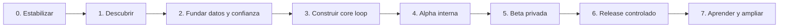

# Plan de desarrollo paso a paso — HEXIS

**Horizonte de referencia:** 14–16 semanas hasta una decisión de release controlado, sujeto a capacidad, aprendizaje y gates.
**Regla de avance:** ninguna fecha obliga a saltarse seguridad, datos, accesibilidad o evidencia de usuario.
**Estado base:** prototipo funcional incompleto; auditoría inicial `BLOCKED / NO-GO`.

> **Convención:** “Fase 0/1/2…” indica secuencia temporal. “P0/P1/P2” indica prioridad de requisito y no corresponde al número de fase.

## 1. Orden de trabajo

El benchmark precede al PRD; el PRD precede al rediseño; seguridad/datos preceden a usuarios reales; QA/auditoría preceden a release.

## 2. Fase 0 — Verdad, repositorio y build confiable

**Duración orientativa:** 1–3 días
**Objetivo:** que el equipo pueda instalar, verificar y generar un bundle móvil sin ambigüedad.

### Pasos

1. Congelar alcance mobile-only; retirar web del MVP.
2. Corregir dependencias directas y alinear Expo SDK 54.
3. Actualizar navegación y eliminar el bootstrap incompatible.
4. Manejar fallo de fuentes/configuración sin pantalla vacía.
5. Añadir verificación de sintaxis, tests de dominio, Expo Doctor y bundle Android.
6. Configurar CI con lockfile exacto.
7. Reescribir README con setup, comandos, alcance y gates.
8. Decidir formalmente licencia y visibilidad del repositorio.
9. Definir bundle IDs antes del primer build distribuido.

### Entregables

- Dependencias/lockfile reproducibles.
- Scripts `doctor`, `test`, `verify:syntax`, `export:android` y `check`.
- CI inicial.
- Documentación de entorno.
- Informe de auditoría actualizado.

### Gate T0

- `npm ci` = 0.
- Tests/sintaxis = 0.
- Expo Doctor = 100% en entorno con Node/npm soportados.
- Export Android = 0.
- Export JavaScript iOS = 0 en CI; el build nativo firmado requiere macOS/credenciales antes de beta.
- Cero import directo sin declarar.

## 3. Fase 1 — Descubrimiento y prototipo del núcleo

**Duración orientativa:** semana 1–2, en paralelo seguro con trabajo fundacional.
**Objetivo:** validar que el segmento entiende y desea el ciclo, antes de construir todo.

### Pasos

1. Reclutar 12–15 adultos del segmento inicial.
2. Entrevistar intentos previos, interrupciones, privacidad y lenguaje.
3. Mapear journey actual y momentos de abandono.
4. Prototipar onboarding, Hoy, estado de fallo y revisión semanal.
5. Ejecutar 5–8 pruebas moderadas/no moderadas.
6. Medir tiempo, comprensión, errores y reacción al tono.
7. Ajustar PRD; congelar P0 y no-objetivos.
8. Crear design system accesible y assets de marca finales.

### Preguntas que deben responderse

- ¿“Identidad” se entiende sin explicación filosófica?
- ¿El usuario puede crear un plan en menos de cuatro minutos?
- ¿Uno a tres compromisos se siente suficiente?
- ¿Qué copy ayuda a volver después de fallar?
- ¿La métrica física aporta o introduce fricción/ansiedad?
- ¿Qué datos rehúsa registrar el segmento?

### Gate P1

- ≥80% de participantes completa el prototipo sin asistencia crítica.
- El posicionamiento se puede repetir en palabras propias.
- El tono se percibe directo y respetuoso, no punitivo.
- P0 congelado y trazado a requisitos.

## 4. Fase 2 — Backend reproducible y confianza

**Duración orientativa:** semana 2–3.
**Objetivo:** crear una frontera segura antes de ampliar funciones.

### Pasos

1. Obtener acceso de desarrollo a Supabase y crear backup.
2. Exportar/inventariar esquema, policies, triggers y datos legacy.
3. Versionar baseline sin modificar producción.
4. Diseñar `profiles`, `plans`, `habits`, `habit_completion_events`, métricas y reviews.
5. Crear constraints de idempotencia y funciones atómicas.
6. Activar RLS deny-by-default en cada tabla.
7. Escribir tests usuario A, usuario B y anónimo por operación.
8. Migrar datos en staging y reconciliar conteos.
9. Unificar auth: signed out, pending confirmation y signed in.
10. Completar recuperación, logout, revocación y sesión segura.
11. Definir retención, exportación y eliminación.

### Gate T1

- Cero acceso cruzado en tests.
- Registro sin sesión nunca accede a Main.
- Mutaciones idempotentes y atómicas.
- Fecha civil correcta en zonas probadas.
- Backup/restore verificado.
- Exportación/eliminación diseñadas y con owners.

## 5. Fase 3 — Construir el core loop vertical

**Duración orientativa:** semana 3–6.
**Objetivo:** entregar un camino completo, no pantallas aisladas.

### Sprint 3A — Compromiso

1. Identidad objetivo, meta y motivo.
2. Elegir/crear 1–3 compromisos.
3. Definir acción mínima, frecuencia, señal y zona.
4. Resumen editable y confirmación.
5. Instrumentar activación sin contenido privado.

**Salida:** el usuario llega a Hoy con un plan real y puede editarlo.

### Sprint 3B — Disciplina

1. Query de compromisos aplicables a la fecha civil.
2. Check-in/deshacer idempotente.
3. Estados syncing/pending/error/confirmed.
4. Historial por eventos.
5. Racha programada, consistencia 7/30 y reentrada.
6. Recordatorios después de elegir horario.
7. Actualización al recuperar foco.

**Salida:** el check-in crítico tarda ≤60 segundos y nunca muestra falso éxito.

### Sprint 3C — Transformación

1. Activar una métrica opcional.
2. Registrar/editar/eliminar valor, fecha y nota.
3. Tendencia descriptiva y línea base.
4. Revisión semanal en menos de tres minutos.
5. Mantener/reducir/aumentar/sustituir sin perder historial.
6. Calcular SEC Rate de forma auditable.

**Salida:** el usuario completa una semana y toma una decisión basada en evidencia.

### Gate C1

- Journey P0 completo en staging.
- Requisitos HEX-P01 a P11 trazados a test o evidencia.
- No existe feature P1 infiltrada.

## 6. Fase 4 — Calidad de alpha

**Duración orientativa:** semana 6–8.
**Objetivo:** convertir el vertical slice en software confiable.

### Trabajo

- Unit tests: fecha/zona, programación, racha, consistencia, SEC, validación y redacción.
- Integration tests: repositorios, errores, idempotencia y RLS.
- E2E: registro/confirmación, login/logout, check-in, offline, revisión, export/delete.
- Device matrix: teléfono pequeño/grande, iOS soportado mínimo/actual, Android mínimo/actual.
- VoiceOver/TalkBack, texto 200%, contraste, reduce motion, teclado y cutouts.
- Performance: arranque, memoria, listas largas y latencia de check-in.
- Seguridad: dependency review, storage, logs, RLS, abuse/rate limits.
- Privacidad: inventario vs. app/store disclosures.
- Observabilidad: crashes, rendimiento y errores sin PII.
- Soporte: FAQ, contacto y runbook de incidentes.

### Gate Q1

- Cero severidad crítica/alta sin aceptación formal.
- Suites críticas verdes.
- Sesiones sin crash ≥99.5% durante dogfood.
- Flujos P0 accesibles.
- Bundle iOS/Android firmado para pruebas.

## 7. Fase 5 — Beta privada y evidencia de valor

**Duración orientativa:** semana 8–12; piloto concierge de cuatro semanas.
**Población inicial:** 20–30 personas; ampliar solo si los guardrails permanecen sanos.

### Pasos

1. Consentimiento y expectativa clara: beta, no servicio clínico.
2. Instrumentar activación, D1/D7/D30, SEC y retorno tras fallo.
3. Revisar errores/sync/crashes diariamente sin leer contenido privado.
4. Entrevistas breves semana 1 y semana 4.
5. Medir comprensión de privacidad y reacción al tono.
6. Priorizar correcciones por impacto en core loop.
7. Evitar IA, comunidad, fotos o monetización durante el piloto.

### Gate V1

- Finalización onboarding ≥65%.
- Activación 24h ≥50%.
- D7 de activados ≥35%.
- SEC Rate semana 2 ≥30%.
- Guardrails de seguridad, sync, accesibilidad y bienestar dentro de límite.
- Evidencia cualitativa de que la revisión conduce a decisiones.

Los umbrales son hipótesis de aprendizaje; fallarlos no se oculta ni se “arregla” cambiando la definición después de ver el resultado.

## 8. Fase 6 — Release público controlado

**Duración orientativa:** semana 12–16, solo si V1 pasa.
**Objetivo:** publicar con capacidad de observar, soportar y retroceder.

### Pasos

1. Fijar versionado, release notes y store metadata.
2. Completar app icon/splash/screenshots sin placeholders.
3. Revisar privacidad, términos, claims y age rating.
4. Validar firma, backups, migraciones y rollback.
5. Ejecutar auditoría final: seguridad, privacidad, accesibilidad, QA y verdad.
6. Rollout gradual: 5% → 25% → 100% con ventanas de observación.
7. Definir on-call/owner, respuesta a incidentes y soporte.

### Gate R1

- Auditorías finales aprobadas.
- Cero regresión crítica/alta.
- Dashboards y alertas activos.
- Rollback probado.
- Store disclosures coinciden con el binario.

## 9. Fase 7 — Monetización y expansión, después de evidencia

Orden recomendado:

1. Test de precio y disposición a pagar.
2. Compras/suscripciones con validación server-side, restore y webhooks.
3. Hábitos cuantitativos y métricas múltiples.
4. Inglés y widgets.
5. HealthKit/Health Connect con permisos granulares.
6. Programas editoriales.
7. Fotos bajo privacy/threat review específico.
8. Círculos privados con moderación/abuse controls.
9. HEXIS Pro AI con consentimiento separado, memoria controlable, evals y fallback.

No se autoriza ninguna expansión solo porque un competidor la tenga.

## 10. Backlog priorizado

### P0 — Antes de usuarios reales

- Build reproducible y CI.
- Auth único y completo.
- Secure storage.
- Baseline/migraciones/RLS/tests.
- Fecha civil y zona.
- Mutaciones confiables.
- Logout, exportación, eliminación y política.
- Accesibilidad básica y assets finales.
- Onboarding validado.
- Historial por eventos.
- Consistencia/recuperación.
- Métrica opcional.
- Revisión semanal.
- Recordatorios y offline visible.
- Analítica redactada y observabilidad.

### P1 — Solo después de cerrar el MVP P0

- Refinamientos de copy y journeys surgidos de la beta.
- Reportes descriptivos avanzados.
- Más dominios de objetivo y tipos de métrica.
- Personalización visual no esencial.

### P2 — Solo tras V1

- Monetización.
- Varias métricas/ciclos.
- Integraciones y widgets.
- Contenido editorial.
- Internacionalización completa.

### Prohibido por ahora

- IA, comunidad, feed, fotos, recomendaciones médicas y feature parity indiscriminada.

## 11. Roles y ownership

| Frente | Owner recomendado | Aprobador/gate |
|---|---|---|
| Visión, alcance, SEC | Product Strategist / Product Manager | Product Owner |
| Research y usabilidad | UX Research + Product Design | UX Lead |
| Arquitectura móvil | Mobile Tech Lead | CTO/Tech Lead |
| Datos/migraciones | Data/Backend Engineer | Security + Tech Lead |
| Auth/RLS/privacidad | AppSec + Privacy Engineer | CISO/DPO según etapa |
| Accesibilidad | Accessibility Designer/Tester | QA Lead |
| CI/release | DevOps + Release Engineer | Release Manager |
| Calidad final | QA Lead + Truth Auditor | Project Completion Auditor |

## 12. Definition of Done

Una historia está terminada cuando:

- tiene criterio de aceptación observable;
- incluye estado loading/empty/error/offline cuando aplica;
- propaga errores y no pierde input;
- tiene test proporcional al riesgo;
- funciona con lector de pantalla y texto ampliado;
- no añade PII a logs/analytics;
- actualiza documentación/migración cuando corresponde;
- pasa CI y revisión de seguridad/datos si cruza esa frontera.

Un release está terminado cuando existe evidencia reproducible, no cuando “parece funcionar” en un dispositivo.

## 13. Dependencias externas pendientes

- Acceso al proyecto Supabase y backup de su esquema/datos.
- Decisión de licencia y repositorio público/privado.
- Identificadores iOS/Android y cuentas de Apple/Google/EAS.
- Propietario de políticas legales/privacidad.
- Participantes de research y beta.
- Asset/licencia de Satoshi y logo final.
